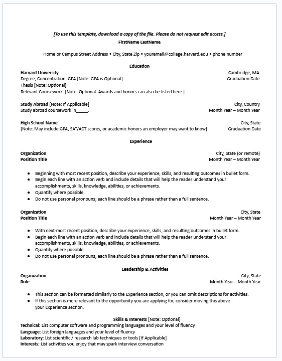

# Frontend Technical Specification

- Create a static website that serves an html resume.

## Resume Format Considerations

I am using the [Harvard Resume Template format](https://careerservices.fas.harvard.edu/resources/create-a-strong-resume/) as the basis of my resume because I am based in the United States and want to use a commonly-accepted format for professional resumes in my country.

### Harvard Resume Format

I am using GenAI generate the HTML (and possibly CSS).  From there, I will manually refactor the code to my preferred standard.

Prompt to Grok 4.1:

```test
Convert this resume format into html.
Please don't use a css framework.
Please use the least amount of css tags.
````

Image provided to LLM:



This is the [generated output](./docs/resume-minimal-01122026.html) which I will tweak.

This is what the generated HTML looked like unaltered:


## HTML Adjustments

- UTF8 will support most languages (including English) so I will leave this meta tag in
- I am applying mobile styling to my site, so I will include the viewport meta tag width=device-width so mobile styling scales normally
- I am extracting styles into its own stylesheet after I am happy with my HTML markup
- I'll simplify my HTML markup css selector to be as minimal as possible 